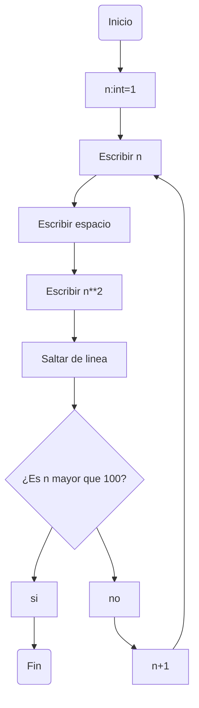
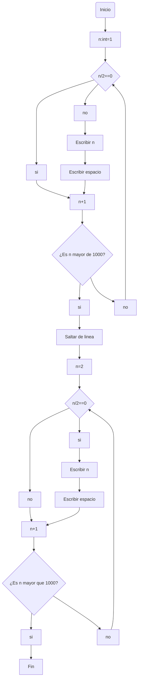
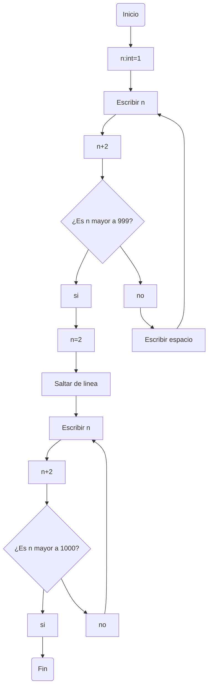
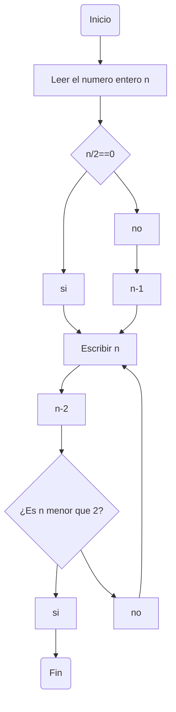

# Reto-6

En este repositorio se pondran los resultados del cumplimiento del reto numero 6 (los diagramas dentro del archivo readme y la resolucion adiconal en el archivo de notebook de jupyter

##Diagramas de fluijo:

### 1. Imprimir un listado con los números del 1 al 100 cada uno con su respectivo cuadrado.

### 2. Imprimir un listado con los números impares desde 1 hasta 999 y seguidamente otro listado con los números pares desde 2 hasta 1000.

(En este punto tengo dos posturas, la primera es la mas organizadita y "juiciosa" de hacer para tomar en cuenta todos los casos aunque no sean necesarios, poe si acaso luego se quierne cambiar las condiciones, para no tener que cambiar toda la lgocia, la segunda es la mas eficiente, pero tal vez un poco "hardcodeada" en mi opinion, pero por eso esta como alternativa.)

### 3. Imprimir los números pares en forma descendente hasta 2 que son menores o iguales a un número natural n ≥ 2 dado
(aqui tambien se podrian tomar ambas perspectivas, pero voy, 

   
